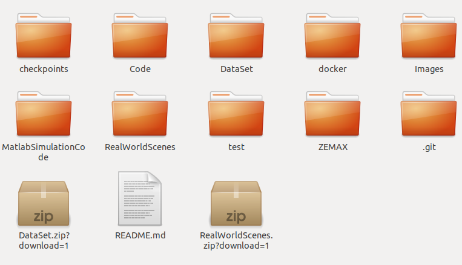

# Deep Depth-of-Field for Microscopy On-The-Go
Tensorflow implementation of the paper "Deep Depth-of-Field for Microscopy On-The-Go".

The implementation is based on the paper "Scale-recurrent Network for Deep Image Deblurring" and its [github repository](https://github.com/jiangsutx/SRN-Deblur).

## Installation
### Download the repository
```bash
git clone https://github.com/VISEAONLab/microscopy_deep_dof
cd microscopy_deep_dof/
```

### Docker 
We use a docker image with Tensorflow 1.15 and Python 2.7 on NVIDIA TITAN Xp.
We recommend using the docker file to ensure that all dependencies are correctly installed.

#### To build the image:
```bash
docker build -t srn-deblur docker
```

#### To enter the docker container:
Replace in the following line the phrase <'path/to/base/folder'> with your base folder name (ending with microscopy_deep_dof), and then run the command
```bash
docker run --rm -it --gpus 0 -v <'path/to/base/folder'>:/opt/project srn-deblur
```

## Datasets

### Download the available datasets from Zenodo:
```bash
wget https://zenodo.org/record/6822198/files/DataSet.zip?download=1
wget https://zenodo.org/record/6822198/files/RealWorldScenes.zip?download=1
unzip DataSet.zip?download=1 
unzip RealWorldScenes.zip?download=1
```

### The base folder, microscopy_deep_dof,  should now look like this:



- [`RealWorldScenes`](RealWorldScenes) contains the real-world scenes that were deblurred using the network and presented in the paper.
- For training, you should perform additional steps on the dataset, explained below.


## Checkpoints

Our final checkpoints (trained version of the SRN-Deblur network) are available in [`checkpoints/color/FinalCheckpoints`](checkpoints/color/FinalCheckpoints).

## Inference using the trained model
Run these lines inside the docker environment.

For scenes taken in the lab (outside the water): 
```bash
python my_run_model.py --input_path '/opt/project/RealWorldScenes/Lab/OneShots' --output_path '/opt/project/test/Lab'
```

For scenes taken underwater:
```bash
python my_run_model.py --input_path '/opt/project/RealWorldScenes/UnderWater/OneShots' --output_path '/opt/project/test/UnderWater'
```

## Training dataset creation

- In [`CodeForDataSetCreation`](MatlabSimulationCode/CodeForDataSetCreation), you may find the related Matlab script to create the datasets. 
  - [`RunSteps`](MatlabSimulationCode/CodeForDataSetCreation/RunSteps.m) creates the kernels for the requested focal planes and their out-of-focus planes. To run this script, you need to have access to the ZEMAX software. In [`ZEMAX`](ZEMAX), you can find the OpticStudio ZEMAX files for our imaging system.
  - [`MakeKernelStack`](MatlabSimulationCode/CodeForDataSetCreation/MakeKernelStack.m) creates the final kernels used for deblurring the images. Each kernel is formed using the kernels in the previous step according to the procedure explained in the paper. Please note that you can find the kernels produced at the end of this stage in the folder `DataSet`.
  - [`BlurImgKernels`](MatlabSimulationCode/CodeForDataSetCreation/BlurImgKernels.m) creates blurred images using the kernels produced in the previous stage and the sharp images. The sharp images are in the folder `DataSet`.
  - [`MakeTripletsForTrain`](MatlabSimulationCode/CodeForDataSetCreation/MakeTripletsForTrain.m) creates the list of the dataset used for training the SRN-Deblur network. The list contains the sharp images, the blurred images, and the corresponding kernels. 

### Creating the blurred images (using the existing kernels):

- Edit the `BaseFolderName` in [`BlurImgKernels`](MatlabSimulationCode/CodeForDataSetCreation/BlurImgKernels.m) to the full path of your base folder (ending with microscopy_deep_dof).
- Run the file through Matlab.

<!-- 1. Open Matlab
2. Open the file BlurImgKernels from the folder microscopy_deep_dof/MatlabSimulationCode/CodeForDataSetCreation
3. Write the full path to the base folder (ending with microscopy_deep_dof)
4. Run the file -->

### Preparing the dataset for the network:

- Edit the `BaseFolderName` in [`MakeTripletsForTrain`](MatlabSimulationCode/CodeForDataSetCreation/MakeTripletsForTrain.m) to the full path of your base folder (ending with microscopy_deep_dof).
- Run the file through Matlab.

<!-- 1. Open the file MakeTripletsForTrain
2. Write the same base folder (ending with microscopy_deep_dof)
3. Run the file -->

## Training
<!-- ### Run the following code to run the network -->
<!-- ### Run these lines inside the docker environment. -->

Replace `<'folder name for the run'>` with your experiment name, and then run the command inside the docker environment
```bash
python my_run_model.py --phase 'train' --expname <'folder name for the run'> --step 0
```
